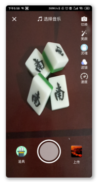
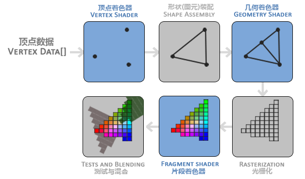

# MicroVideo
 android 短视频录入




在OpenGL中，任何事物都在3D空间中，而屏幕和窗口却是2D像素数组，这导致OpenGL的大部分工作都是关于把3D坐标转变为适应你屏幕的2D像素。3D坐标转为2D坐标的处理过程是由OpenGL的图形渲染管线（Graphics Pipeline，大多译为管线，实际上指的是一堆原始图形数据途经一个输送管道，期间经过各种变化处理最终出现在屏幕的过程）管理的。图形渲染管线可以被划分为两个主要部分：

- 第一部分把你的3D坐标转换为2D坐标，
- 第二部分是把2D坐标转变为实际的有颜色的像素。

在Opengl2.0中是固定的渲染管线，3.0中是开放的管线。


1. opengl 是什么？[参考](https://www.zhihu.com/question/51867884/answer/128190651) 

   ```
   OpenGL是Khronos Group开发维护的一个规范，它主要为我们定义了用来操作图形和图片的一系列函数的API，需要注意的是OpenGL本身并非API。GPU的硬件开发商则需要提供满足OpenGL规范的实现，这些实现通常被称为“驱动”，它们负责将OpenGL定义的API命令翻译为GPU指令。
   ```

2. opengl 在图像处理中起什么作用

   ```
   是一个接口，用于规范，规范的内容是
   ```

4. opengl 暴露了哪些接口

4. 音视频的基本概念：顶点，片元，片段，纹理

   ```
   现实生活中，纹理最通常的作用是装饰我们的物体模型，它就像是贴纸一样贴在物体表面，使得物体表面拥有图案。但实际上在OpenGL中，纹理的作用不仅限于此，它可以用来存储大量的数据，一个典型的例子就是利用纹理存储地形信息。
   ```

   

   

5. opengl 的与android 如何友好的转化信息？坐标？

6. 音视频这块涉及哪些类：camera、MediaPlay、ffmpeg、MediaCodec、MediaRecord


- `OpenGL`：理解成一个API接口规范，具体实现则交给硬件厂商来做
- `OpenGL ES`：`OpenGL`的子集，专门针对手机、平板等嵌入式设备
- `GLSL`：用于编写`OpenGL`着色器的专门语言
- `GLSL ES`：像`OpenGL ES`是`OpenGL`的子集一样，是`GLSL`的子集
- 固定渲染管线：在`OpenGL`的早期版本里，`OpenGL`提供了一套固定的着色器程序，我们只要调用API设置好参数就行了，这叫固定管线
- 可编程渲染管线：在新版本里，`OpenGL`不再提供默认着色器程序，需要我们手动实现，虽然学习、使用的时候比较麻烦，但是灵活性更高了，这就叫可编程管线

但在`OpenGL`中，我们经常找不到这个传入、传出的数据。这是因为，大多数`OpenGL`的API，都是在对一个公用的存储空间进行操作，每个操作的指令，导致公用存储空间内数据进行相应的变化，所以经常有技术帖说`OpenGL`实质上是个大型状态机。

聊完了基本知识以后，就来看`OpenGL`的具体逻辑流程了。因为我们现在大多用的都是可编程渲染管线了，所以按照可编程管线的流程来说，大致分成这么几步：


- 顶点着色器：`vertex Shader`，是根据顶点数据，确定三角形的三个顶点的位置

- 图元装配：根据上一步的顶点位置，装配成基本的图元形状，比如三角形

- 几何着色器：对上一步的图元进行变换，形成新的图元，具体细节还没研究

- 光栅化：把图元映射为最终显示在屏幕上的像素，同时也会裁掉屏幕显示范围之外的内容

  光栅化：把每个点、直线和三角形分解为大量的小片段，然后映射到屏幕上，通常上一个片段对应一个像素点，但是在高分辨率下存在使用较大片段。

- 片段着色器：`Fragment Shader`，计算每个像素的颜色，计算规则受了很多因素的影响，例如光照之类的3D场景数据

  片段着色器的目的：告诉GPU每个片段最终的颜色是什么，对于每个片段的着色器都会被调用一次。

- Alpha测试及混合：因为每个屏幕像素点上，可能堆叠了多个颜色数据，所以就要根据深度、alpha值进行计算


[android API Document](https://developer.android.com/guide/topics/graphics/opengl) 

[learnOpenGl](https://learnopengl-cn.github.io/) 

[opengl refrence  2.0 ](https://www.khronos.org/registry/OpenGL-Refpages/es2.0/) 

[通俗易懂的 OpenGL ES 3.0（一）入门必备知识](https://laishujie.coding.me/2018/09/23/通俗易懂的 OpenGL ES （一）入门必备知识/) 

[OpenGL ES和坐标变换（一）](http://zhangtielei.com/posts/blog-opengl-transformations-1.html) 

[图像显示、OpenGL、离屏渲染、滤镜等等的一些小事](https://benarvintec.com/2019/08/24/图像显示、OpenGL、离屏渲染、滤镜等等的一些小事/)

[opengl](https://github.com/benhero/GLStudio)  

[通俗易懂的 OpenGL ES 3.0（二）渲染三角形](https://laishujie.coding.me/2018/11/21/通俗易懂的 OpenGL ES 3.0（二）渲染三角形/) 

[openGL ES初步学习](https://elliotsomething.github.io/2018/05/10/openGLESLearning/) 

[openGL ES渲染管线详解](https://zhuanlan.zhihu.com/p/100086295) 

[你好，三角形](https://learnopengl-cn.github.io/01 Getting started/04 Hello Triangle/) 

https://www.jianshu.com/p/a818684333f2 

[[OpenGL]OpenGL纹理](https://blog.csdn.net/baidu_28949227/article/details/92838099) 

[手把手带你实现抖音短视频特效](https://juejin.im/entry/5b98bf1b5188255c960c1c91#comment) 

[Android OpenGL顶点及绘制基础知识](https://www.jianshu.com/p/0701d9c7f01b) 

[Android OpenGL顶点及绘制基础知识](https://www.jianshu.com/p/0701d9c7f01b) 

[Android openGl开发详解(一)——简单图形的基本绘制](https://www.jianshu.com/p/92d02ac80611) 

[从显示一张图片开始学习OpenGL ES](https://juejin.im/post/5ba3520de51d450e4f38b440) 

[Android 音视频开发入门指南](https://zhuanlan.zhihu.com/p/28518637) 

[Android 音视频开发打怪升级：OpenGL渲染视频画面篇](https://juejin.im/post/5dae6469e51d45249850cf6f) 

[Android 音视频开发学习思路](https://www.cnblogs.com/renhui/p/7452572.html) 


刚才我们谈到图像处理，在做图像处理我们不是可以用Canvas来绘制吗，怎么还要用OpenGL那么陌生的东西来搞？为什么要用OpenGL，肯定有它的好处。

- OpenGL的好处：手机上做图像处理有很多方式，但是目前为止最高效的方法是有效地使用图形处理单元，或者叫 GPU；GPU 可以集中来处理好一件事情，就是并行地做浮点运算。事实上，图像处理和渲染就是在将要渲染到窗口上的像素上做许许多多的浮点运算。也就是说用GPU来分担CPU的工作，提高工作效率。


opengl 红宝书阅读记录：

- opengl是编程接口，它是一种可以对图形硬件设备特性进行访问的软件库，一个渲染系统，数据源还是来自于camera

   

-  


之所以要开启一个buffer则是因为，要给c用，开辟在栈空间内，而java开辟的是堆中，所以要单独开辟


GlSurfaceView作用简单的理解OpenGl对相机数据进行处理完之后的显示。我们需要明白的是渲染器的渲染周期及渲染方法的调用时机。


NDK gnustl_static编译问题
原创huangkangying 最后发布于2019-05-09 21:59:53 阅读数 1831  收藏
展开
当使用较新的NDK编译带OpenCV的工程时会遇到编译问题。

```c
android undefined reference to 'std::basic_ostream<char, std::char_traits<char> >
```

有两种解决办法：

（1）在你的gradle中加入如下代码，这只对NDK 18rc以下的版本有效

```groovy
externalNativeBuild {
    cmake {
        cppFlags "-std=c++11"
        arguments "-DANDROID_STL=gnustl_static"
    }
}
```

（2）对NDK 18rc以上的版本，gnustl_static已经不再支持，gnustl_static 改 c++_static,opencv 升级到4
